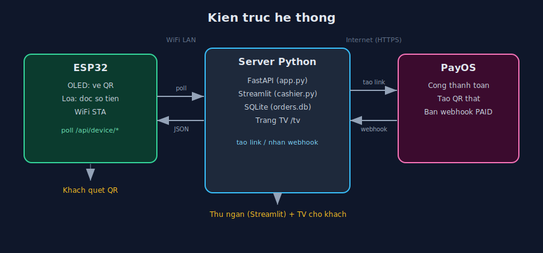

# 00 - Tong quan he thong

## 1. He thong nay lam gi?

Smart QR Payment la he thong thanh toan ma QR cho quan nho (mo hinh quan cafe / quay ban hang):

- Thu ngan tao don tren may tinh (giao dien Streamlit).
- Mot man hinh **OLED gan tai quay** hien ma QR PayOS de khach quet bang app ngan hang.
- Khi khach thanh toan thanh cong, **loa** doc to so tien ("da nhan duoc muoi mot nghin dong") va OLED bao "THANH CONG".
- Mot **man hinh TV** chieu danh sach don + trang thai cho khach theo doi (kieu so thu tu quan cafe).

Toan bo tien thuc te chay qua **PayOS** (cong thanh toan QR cua Viet Nam).

## 2. Cac thanh phan

| Thanh phan | Cong nghe | Vai tro |
|-----------|-----------|---------|
| Firmware ESP32 | C++ / PlatformIO / Arduino core | Dieu khien OLED (ve QR) + loa (doc tien), noi WiFi, poll server |
| Backend | Python / FastAPI | "Nao": tao link PayOS, nhan webhook, luu don (SQLite), phuc vu ESP32 + TV |
| Cashier | Python / Streamlit | Quay thu ngan: chon mon / nhap tien -> tao don |
| Trang TV | HTML (do backend tra ra) | Man hinh chieu hang doi don cho khach |
| PayOS | Dich vu ben ngoai | Tao QR thanh toan thuc, bao ket qua qua webhook |

## 3. Kien truc tong the



```
                          WiFi LAN                     Internet
  +-------------------+              +----------------+            +-----------+
  |  ESP32            |  HTTP poll   |  Server Python |   HTTPS    |  PayOS    |
  |  - OLED SH1106    | -----------> |  - FastAPI     | ---------> |  (cong    |
  |  - Loa MAX98357A  | <----------- |  - Streamlit   | <--------- |  thanh    |
  |                   |   JSON       |  - SQLite      |  webhook   |  toan)    |
  +-------------------+              +----------------+            +-----------+
        |                                   |
        | hien QR / doc tien                | TV: /tv (trinh duyet)
        v                                   v
   Khach quet dien thoai            Khach xem so thu tu don
```

Vi sao ESP32 **poll** (hoi lien tuc) server chu khong nhan day?
- ESP32 nam trong LAN, khong co dia chi cong khai, server kho goi nguoc vao.
- Poll moi 1.5s du nhanh cho trai nghiem quay ban hang, code don gian, on dinh.

Vi sao server dung **webhook** tu PayOS (khong poll PayOS)?
- Webhook realtime, it goi API, dung chuan PayOS khuyen nghi.
- Ban da co URL cong khai (cloudflare tunnel / VPS DigitalOcean) nen webhook kha thi.

## 4. Luong hoat dong day du

```
[1] Thu ngan bam "TAO DON" tren Streamlit
        |
        v
[2] Streamlit  --POST /api/orders-->  Backend
        |
        v
[3] Backend  --REST /v2/payment-requests-->  PayOS
        |                                       |
        |  <----- qrCode, checkoutUrl ----------+
        v
[4] Backend luu don vao SQLite (status=PENDING), tra ve cho Streamlit
        |
        v
[5] ESP32 poll GET /api/device/current  ->  nhan qr_code, amount, queue_no
        |
        v
[6] ESP32 ve QR len OLED  ->  khach quet & chuyen tien
        |
        v
[7] PayOS  --POST /api/payment/payos-webhook-->  Backend (kem chu ky)
        |
        v
[8] Backend verify chu ky -> mark_paid (status=PAID, paid_event_pending=1)
        |
        v
[9] ESP32 poll GET /api/device/paid-event  ->  nhan {paid:true, amount, queue_no}
        |
        v
[10] ESP32: loa doc so tien + OLED "THANH CONG" (>= 4 giay)
        |
        v
[11] Quay lai [5] cho don tiep theo
```

## 5. Trang thai mot don hang

```
   tao don            webhook PAID
PENDING  ----------->  PAID  --(ESP32 da doc loa)--> van PAID
   |
   | thu ngan bam Huy
   v
CANCELLED
```

- `PENDING`: vua tao, dang cho khach quet.
- `PAID`: PayOS xac nhan da nhan tien. Co `paid_event_pending=1` cho den khi ESP32 lay su kien (de phat loa dung 1 lan).
- `CANCELLED`: thu ngan huy.

## 6. Cau truc thu muc

```
version1/
├─ README.md              <- huong dan nhanh (quick start)
├─ docs/                  <- TAI LIEU CHI TIET (ban dang doc)
│   ├─ 00-tong-quan.md
│   ├─ 01-phan-cung.md
│   ├─ 02-server.md
│   ├─ 03-firmware.md
│   ├─ 04-payos-webhook-deploy.md
│   ├─ 05-doc-so-tien.md
│   └─ 06-van-hanh-su-co.md
├─ server/                <- Python backend + cashier
│   ├─ app.py             <- FastAPI (API + webhook + trang TV)
│   ├─ cashier.py         <- Streamlit (quay thu ngan)
│   ├─ payos_client.py    <- goi PayOS REST + ky chu ky
│   ├─ store.py           <- SQLite (luu don)
│   ├─ requirements.txt
│   ├─ .env.example       <- mau cau hinh
│   └─ .env               <- cau hinh that (KHONG commit, da gitignore)
└─ firmware/              <- ESP32 PlatformIO
    ├─ platformio.ini
    ├─ partitions.csv     <- phan vung flash (app + LittleFS)
    ├─ include/           <- header (.h)
    ├─ src/               <- code (.cpp)
    └─ data/              <- file MP3 doc so tien (nap vao LittleFS)
```

## 7. Doc tiep

- Phan cung & dau day: `01-phan-cung.md`
- Cai dat & chay server, API reference: `02-server.md`
- Build & nap firmware, giai thich code: `03-firmware.md`
- PayOS / webhook / deploy VPS: `04-payos-webhook-deploy.md`
- Engine doc so tien & them MP3: `05-doc-so-tien.md`
- Van hanh & xu ly su co: `06-van-hanh-su-co.md`