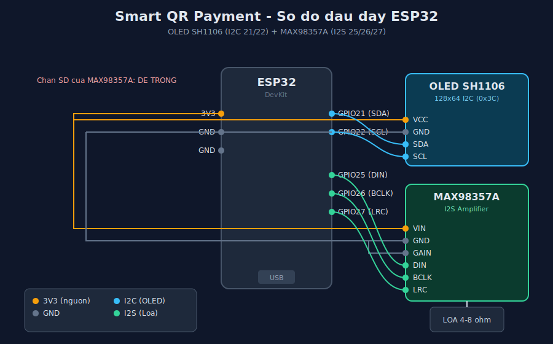

# 01 - Phan cung & dau day

## 1. Danh sach linh kien

| Linh kien | Mo ta | Ghi chu |
|-----------|-------|---------|
| ESP32 DevKit | Vi dieu khien chinh (WiFi + Bluetooth) | Loai ESP32-WROOM / DevKitC / Vietduino deu duoc |
| OLED SH1106 1.3" | Man hinh hien QR + trang thai, giao tiep I2C | 128x64 px, dia chi I2C 0x3C |
| MAX98357A | Mach khuech dai am thanh I2S (DAC + amp) | Xuat ra loa |
| Loa | 4 ohm hoac 8 ohm | Khong dung loa dong (dynamic) |
| Day jumper | Cai (female) - duc (male) tuy header | |
| Cap USB | Nap code + cap nguon ESP32 | |

> Luu y board ESP32 dang Vietduino: nhan in tren board (D4, D5, D6...) co the
> KHAC voi so GPIO thuc te trong code. Luon doi chieu theo bang ben duoi.

## 2. So do chan (GPIO) dung trong code

Dinh nghia trong `firmware/include/config.h`:

```c
// OLED SH1106 (I2C)
#define I2C_SDA   21
#define I2C_SCL   22

// Loa MAX98357A (I2S)
#define I2S_DOUT  25   // DIN tren MAX98357A
#define I2S_BCLK  26   // BCLK
#define I2S_LRC   27   // LRC (WS)
```

## 3. Dau day OLED SH1106 (I2C)

| OLED | ESP32 | Ghi chu |
|------|-------|---------|
| VCC  | 3V3   | Co the dung 5V neu module ho tro |
| GND  | GND   | |
| SDA  | GPIO21 | Duong du lieu I2C |
| SCL  | GPIO22 | Duong xung I2C |

```
   OLED SH1106                ESP32
  +-----------+
  | VCC  o----|--------------- 3V3
  | GND  o----|--------------- GND
  | SCL  o----|--------------- GPIO22
  | SDA  o----|--------------- GPIO21
  +-----------+
```

OLED va cac thiet bi I2C khac (neu them sau) dung chung 2 day SDA/SCL.

## 4. Dau day loa MAX98357A (I2S)

| MAX98357A | ESP32 | Y nghia |
|-----------|-------|---------|
| VIN  | 3V3 (hoac 5V) | Nguon. 5V cho tieng to hon |
| GND  | GND | Mass chung |
| GAIN | GND | Gain mac dinh 9dB |
| DIN  | GPIO25 | Du lieu am thanh so (I2S_DOUT) |
| BCLK | GPIO26 | Bit clock (I2S_BCLK) |
| LRC  | GPIO27 | Word/Left-Right clock (I2S_LRC) |
| SD   | **DE TRONG** | Neu noi GND se TAT mach -> mat tieng |
| SPK+ / SPK- | Loa | Noi truc tiep 2 cuc loa 4-8 ohm |

```
   MAX98357A                  ESP32
  +-----------+
  | VIN  o----|--------------- 3V3 (hoac 5V)
  | GND  o----|--------------- GND
  | GAIN o----|--------------- GND
  | DIN  o----|--------------- GPIO25
  | BCLK o----|--------------- GPIO26
  | LRC  o----|--------------- GPIO27
  | SD   o    |   (de trong)
  | SPK+ o----|---[  LOA  ]
  | SPK- o----|---[ 4-8ohm ]
  +-----------+
```

> CANH BAO: Chan **SD (Shutdown)** phai de trong. Noi xuong GND se tat hoan toan
> mach khuech dai -> loa khong keu du code chay dung.

## 5. So do tong



### So do dang text

```
                    +----------------------------+
                    |          ESP32             |
                    |                            |
        3V3 --------| 3V3                   GPIO21|------- SDA (OLED)
        GND --------| GND                   GPIO22|------- SCL (OLED)
                    |                       GPIO25|------- DIN  (MAX98357A)
                    |                       GPIO26|------- BCLK (MAX98357A)
                    |                       GPIO27|------- LRC  (MAX98357A)
                    |                            |
                    |          USB (nap/nguon)   |
                    +----------------------------+
```

## 6. Bang tra cuu chan (neu board ghi nhan khac)

Mot so board ESP32 Vietduino in nhan D4/D5/D6 cho cac chan I2S:

| Code (GPIO) | Nhan thuong gap tren board |
|-------------|----------------------------|
| GPIO25 | D4 |
| GPIO26 | D5 |
| GPIO27 | D6 |

Neu board ban in dung so GPIO thi cam theo so GPIO.

## 7. Kiem tra phan cung truoc khi chay he thong

1. **Quet I2C**: nap thu sketch trong `test oled sh1106 esp32 viet makerlab` -> Serial in dia chi `0x3C` nghia la OLED OK.
2. **Beep loa**: nap thu code trong `test MAX98357A loa` -> nghe tieng noi/nhac nghia la loa OK.
3. Sau khi 2 module roi chay tot moi nap firmware tong `version1/firmware`.

## 8. Luu y cap nguon

- Khi loa keu to (volume 21), dong dien tang. Neu dung nguon USB may tinh yeu co the bi sut ap -> ESP32 reset. Dung cu sac dien thoai 5V/1A tro len cap rieng cho on dinh.
- Cap chung GND giua ESP32 va MAX98357A la bat buoc.