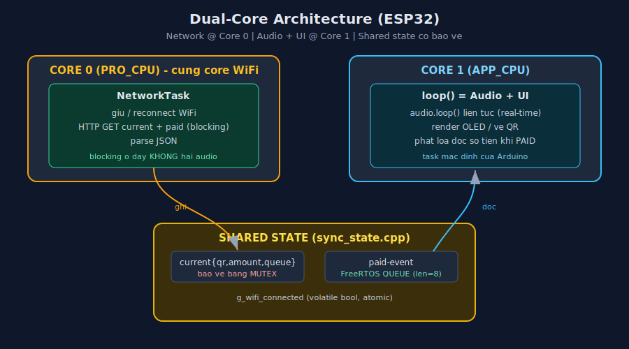

# 08 - Dual-Core Architecture (Thiet ke - lam sau)

> **Trang thai: THIET KE / CHUA TRIEN KHAI.**
> Tai lieu nay mo ta day du kien truc dual-core du dinh ap dung cho firmware ESP32.
> Firmware hien tai (ban single-loop) van dang chay. Doc nay de tri+en khai sau,
> KHONG anh huong server (server giu nguyen 100%).

## 1. Tai sao can dual-core

### 1.1. Van de cua ban single-loop hien tai
Firmware hien tai chay moi thu tren 1 vong `loop()` (Core 1):
```
loop():
  audio.loop();                  // can goi LIEN TUC (vai ms/lan) de bom buffer I2S
  net_get_paid_event(...);       // HTTP GET blocking, timeout toi 4 giay
  net_get_current(...);          // HTTP GET blocking, timeout toi 4 giay
  oled_show_*(...);
```

Xung dot thoi gian THUC SU:
- `audio.loop()` (thu vien ESP32-audioI2S) phai duoc goi rat thuong xuyen, neu khong
  tieng bi **giat / re**.
- `net_get_*()` dang goi HTTP GET **chan (blocking)** den **4 giay** (`http.setTimeout(4000)`).

=> Khi WiFi chap chon hoac server cham, 1 request GET co the "dong bang" `loop()` vai giay.
   Neu luc do **loa dang doc dang dở so tien**, `audio.loop()` khong duoc goi -> tieng dung/re.

### 1.2. Dual-core giai quyet
ESP32 co 2 nhan:
- **Core 0 (PRO_CPU)**: noi WiFi stack chay.
- **Core 1 (APP_CPU)**: noi `loop()` cua Arduino chay mac dinh.

Y tuong: tach phan **chan (network)** sang Core 0, giu phan **real-time (audio) + UI** o Core 1.
Khi network blocking, no chi blocking tren Core 0, **khong dung toi audio o Core 1**.

## 2. Quyet dinh thiet ke (da chot)

| # | Van de | Quyet dinh |
|---|--------|-----------|
| 1 | So luong task | **2 task**: NetworkTask (Core 0) + loop/Audio+UI (Core 1) |
| 2 | Dong bo du lieu | **Mutex** cho `current` + **FreeRTOS queue** cho paid-event |
| 3 | HTTP | Giu **blocking**, giam timeout 4000->3000ms, them WiFi reconnect trong NetworkTask |
| 4 | Pham vi | Chi refactor **firmware**. Server / API / PayOS giu nguyen |

### Vi sao gop Audio + UI chung Core 1 (khong tach 3 task)?
- QR (nang CPU: `qrcode_initText` + `sendBuffer`) hien khi don **PENDING**.
- Loa doc khi don **PAID**.
- Hai viec nang nay gan nhu **khong xay ra cung luc** -> hiem khi tranh CPU.
- Tach AudioTask rieng la kha thi nhung phuc tap hon ma loi ich thap.

### Vi sao NetworkTask o Core 0?
- Driver WiFi cung chay o Core 0 -> giam overhead chuyen core khi goi socket.

## 3. So do kien truc dual-core



```
+--------------------------- ESP32 ---------------------------+
|                                                             |
|  CORE 0 (PRO_CPU)              CORE 1 (APP_CPU)             |
|  +----------------------+      +-------------------------+  |
|  |   NetworkTask        |      |  loop() = Audio + UI    |  |
|  |  (xTaskCreatePinned) |      |  (task mac dinh Arduino)|  |
|  |                      |      |                         |  |
|  |  - giu/reconnect WiFi|      |  - audio.loop() lien tuc|  |
|  |  - HTTP GET current  |      |  - doc shared state     |  |
|  |  - HTTP GET paid     |      |  - render OLED          |  |
|  |  - parse JSON        |      |  - phat loa khi PAID    |  |
|  |        |             |      |        ^                |  |
|  +--------|-------------+      +--------|----------------+  |
|           |  ghi                        |  doc              |
|           v                             |                   |
|     +--------------------------------------------+          |
|     |  SHARED STATE (sync_state.cpp)             |          |
|     |   - current{has,qr,amount,queue} + MUTEX   |          |
|     |   - paid-event QUEUE (xQueue, len=8)       |          |
|     |   - g_wifi_connected (volatile bool)       |          |
|     +--------------------------------------------+          |
+-------------------------------------------------------------+
```

## 4. Phan chia so huu phan cung (tranh race)

Nguyen tac vang: moi peripheral chi do **MOT task** dung.

| Tai nguyen | Task duy nhat duoc dung | Ghi chu |
|-----------|------------------------|---------|
| WiFi / HTTPClient | NetworkTask (Core 0) | Khong task khac goi socket |
| I2S / Audio (loa) | loop/UI (Core 1) | `audio.loop()`, `connecttoFS` |
| I2C / U8g2 (OLED) | loop/UI (Core 1) | `sendBuffer`, ve QR |
| LittleFS | loop/UI (Core 1) | doc file MP3 (do Audio dung) |

=> Khong peripheral nao bi 2 core dung chung. Chi co **du lieu** dung chung -> bao ve bang
   mutex/queue.

## 5. Dong bo du lieu chi tiet

### 5.1. `current` - bao ve bang Mutex
Ly do dung mutex (khong dung volatile): `current` chua `String qr_code`, copy khong atomic.
Doc/ghi giua chung khi dang copy String -> hong bo nho.

```cpp
struct CurrentState {
  bool          has_order;
  String        qr_code;
  unsigned long amount;
  int           queue_no;
};

static CurrentState   g_current;
static SemaphoreHandle_t g_current_mutex;   // tao bang xSemaphoreCreateMutex()

// NetworkTask ghi:
void state_set_current(bool has, const String& qr, unsigned long amt, int q) {
  if (xSemaphoreTake(g_current_mutex, portMAX_DELAY) == pdTRUE) {
    g_current.has_order = has;
    g_current.qr_code   = qr;     // copy String trong vung khoa -> an toan
    g_current.amount    = amt;
    g_current.queue_no  = q;
    xSemaphoreGive(g_current_mutex);
  }
}

// UI task doc (copy ra bien cuc bo roi nha khoa ngay, render ngoai khoa):
bool state_get_current(String& qr, unsigned long& amt, int& q) {
  bool has = false;
  if (xSemaphoreTake(g_current_mutex, pdMS_TO_TICKS(50)) == pdTRUE) {
    has = g_current.has_order;
    qr  = g_current.qr_code;
    amt = g_current.amount;
    q   = g_current.queue_no;
    xSemaphoreGive(g_current_mutex);
  }
  return has;
}
```
> Quy tac: GIU KHOA THAT NGAN. Chi copy du lieu trong vung khoa, render OLED (cham) lam
> NGOAI vung khoa de khong chan NetworkTask lau.

### 5.2. paid-event - dung FreeRTOS Queue
Ly do dung queue (khong dung co): paid-event la su kien "1 lan", queue dung ngu nghia va
tu thread-safe. Neu UI dang doc loa dở, event nam cho trong queue -> doc xong xu ly tiep
(tu dong xep hang).

```cpp
struct PaidEvent {
  unsigned long amount;
  int           queue_no;
};

static QueueHandle_t g_paid_queue;   // xQueueCreate(8, sizeof(PaidEvent))

// NetworkTask day vao:
void state_push_paid(unsigned long amt, int q) {
  PaidEvent e { amt, q };
  xQueueSend(g_paid_queue, &e, pdMS_TO_TICKS(10));   // timeout nho; queue gan nhu khong bao gio day
}

// UI task lay ra (khong block):
bool state_pop_paid(unsigned long& amt, int& q) {
  PaidEvent e;
  if (xQueueReceive(g_paid_queue, &e, 0) == pdTRUE) {
    amt = e.amount; q = e.queue_no;
    return true;
  }
  return false;
}
```

Rui ro mat su kien: server "pop 1 lan", nen neu NetworkTask nhan `paid:true` ma queue day
thi mat (loa khong doc). Giam thieu: queue dai **8** (su kien rat hiem, moi giao dich 1 cai)
+ `xQueueSend` co timeout. Thuc te khong bao gio day.

### 5.3. Trang thai WiFi
```cpp
static volatile bool g_wifi_connected = false;   // NetworkTask ghi, UI doc
```
Kieu nguyen thuy (bool) doc/ghi atomic tren ESP32 -> khong can khoa. UI dung de hien
"Dang ket noi..." vs "San sang".

## 6. Vong doi tung task

### 6.1. NetworkTask (Core 0)
```
khoi tao WiFi.begin()
loop vo han:
  neu WiFi mat ket noi:
      g_wifi_connected = false
      WiFi.reconnect(); cho vai tram ms; continue
  g_wifi_connected = true

  // poll paid-event truoc (uu tien)
  neu (millis() - last_paid >= POLL_PAID_MS):
      goi GET /api/device/paid-event
      neu paid==true: state_push_paid(amount, queue_no)

  // poll current
  neu (millis() - last_current >= POLL_CURRENT_MS):
      goi GET /api/device/current
      neu co don: state_set_current(true, qr, amount, queue_no)
      nguoc lai:  state_set_current(false, "", 0, 0)

  vTaskDelay(pdMS_TO_TICKS(50));   // nhuong CPU
```

### 6.2. loop() = Audio + UI (Core 1)
```
loop():
  audio_loop();                          // LUON goi dau tien (real-time)

  // dang hien man THANH CONG?
  neu showing_paid:
      neu het thoi gian VA audio doc xong: ve lai "San sang"; return

  // co paid-event moi?
  neu state_pop_paid(amt, q):
      oled_show_paid(amt, q)
      audio_announce_amount(amt)
      showing_paid = true; paid_until = now + 4000
      return

  // cap nhat QR theo current
  neu state_get_current(qr, amt, q):
      neu qr doi: oled_show_qr(qr, amt, q)
  nguoc lai:
      neu truoc do dang hien QR: ve "San sang"

  // neu chua noi WiFi: hien trang thai
  (dua vao g_wifi_connected)
```

> Luu y: vong `loop()` KHONG con goi HTTP truc tiep. Moi network da o NetworkTask.

## 7. setup() moi

```cpp
void setup() {
  Serial.begin(115200);
  oled_init();
  oled_message("Smart QR", "Khoi dong...");
  audio_init();

  sync_state_init();          // tao mutex + queue

  // Tao NetworkTask tren Core 0
  xTaskCreatePinnedToCore(
      NetworkTask,            // ham task
      "NetworkTask",          // ten
      10240,                  // stack 10KB (String + HTTPClient + JSON)
      nullptr,                // tham so
      1,                      // do uu tien
      nullptr,                // handle
      0);                     // CORE 0

  oled_message("Ket noi WiFi", "...");
  // loop() chay tren Core 1 nhu binh thuong -> lam UI + Audio
}
```
> WiFi connect chuyen HAN vao NetworkTask -> `setup()` khong treo 20s nhu ban cu.

## 8. Cau truc file sau refactor

```
firmware/
├─ include/
│   ├─ config.h          (them: POLL_*, stack size neu can)
│   ├─ oled_ui.h         (giu nguyen)
│   ├─ audio_vn.h        (giu nguyen)
│   ├─ net_client.h      (HTTP thuan: bo state, chi tra raw)
│   └─ sync_state.h      (MOI: struct + accessor mutex/queue)
└─ src/
    ├─ main.cpp          (sua: tao task, loop chi UI+Audio)
    ├─ oled_ui.cpp       (giu nguyen)
    ├─ audio_vn.cpp      (giu nguyen)
    ├─ net_client.cpp    (sua: bo blocking trong loop chinh; ham GET tra chuoi)
    └─ sync_state.cpp    (MOI: mutex + queue + g_wifi_connected)
```

Phan **KHONG doi**: `oled_ui.*`, `audio_vn.*`, toan bo `server/`, API contract, `data/` MP3.

## 9. Hop dong API (khong doi)

ESP32 van goi dung 2 endpoint, dung format cu:
- `GET /api/device/current`   -> `{has_order, order_code, amount, qr_code, queue_no}`
- `GET /api/device/paid-event`-> `{paid, order_code, amount, queue_no}`

=> Server, Streamlit, PayOS, webhook giu nguyen 100%. Khong sua file nao trong `server/`.

## 10. Cau hinh moi trong config.h (du kien)

```c
#define POLL_CURRENT_MS   1500
#define POLL_PAID_MS      1500
#define HTTP_TIMEOUT_MS   3000     // giam tu 4000
#define NET_TASK_STACK    10240    // stack NetworkTask
#define NET_TASK_CORE     0        // core gan NetworkTask
```

## 11. Stack & debug

- NetworkTask: 10KB (String + HTTPClient + parse JSON).
- loopTask (UI+Audio): mac dinh 8KB, du cho QR v11 (~466B buffer).
- Log kiem chung dÆ° stack (de lai gon, in moi ~10s):
  ```cpp
  Serial.printf("[NET] stack free: %u bytes\n",
                uxTaskGetStackHighWaterMark(NULL));
  ```
- Log status gon: 1 dong moi 10s (WiFi state, co don hay khong) -> khong spam Serial.

## 12. Race condition - checklist phai dam bao

- [ ] Moi truy cap `g_current` (doc + ghi) deu boc trong mutex.
- [ ] Giu mutex CUC NGAN: copy xong nha ngay, render OLED ngoai vung khoa.
- [ ] Khong goi ham OLED/Audio tu NetworkTask (Core 0).
- [ ] Khong goi WiFi/HTTP tu loop (Core 1).
- [ ] `g_wifi_connected` chi la bool (atomic) -> khong can khoa.
- [ ] paid-event chi qua queue, khong dung bien chia se khac.
- [ ] mutex + queue tao XONG (`sync_state_init`) TRUOC khi tao NetworkTask.

## 13. Ke hoach kiem thu sau khi code

1. **Bien dich**: `pio run` PASS (nhu ban single-loop da PASS truoc do).
2. **Stack**: xem log high-water-mark, dam bao con dÆ° > 1KB moi task.
3. **Audio khong giat khi mang lag**: rut mang / lam server cham giua luc loa dang doc
   so tien -> tieng phai van muot (vi network da tach sang Core 0).
4. **Khong mat paid-event**: tao don, thanh toan, kiem tra loa doc dung 1 lan.
5. **QR cap nhat dung**: tao don moi -> OLED doi QR; huy/het don -> ve "San sang".
6. **Reconnect**: tat/bat lai WiFi router -> NetworkTask tu noi lai, UI phan anh dung.

## 14. Tom tat tradeoffs

**Loi:**
- Audio khong bao gio giat vi network blocking.
- He phan hoi muot; `setup()` khong treo cho WiFi.
- Dung tinh than ESP32 (tan dung 2 core).

**Chi phi:**
- Phuc tap hon: phai lo race condition, mutex, stack size.
- Debug kho hon mot chut.

**Hanh vi nhin tu ngoai: GIU NGUYEN.** Nguoi dung khong thay khac biet, chi la audio on dinh
hon khi mang chap chon.